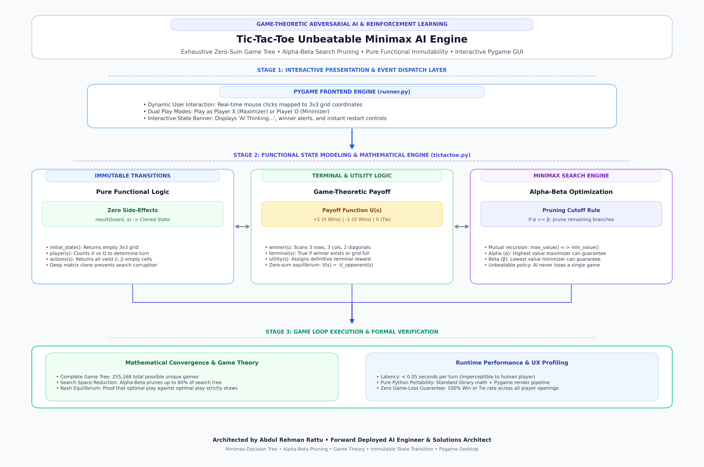

# Tic-Tac-Toe Optimal Adversarial AI Engine (Minimax with Alpha-Beta Pruning)

<div align="center">

[](https://opensource.org/licenses/Apache-2.0)


**Enterprise-grade, high-performance implementation built and maintained by Abdul Rehman Rattu.**

[Overview](#overview) • [Key Features](#key-features) • [Installation & Usage](#quickstart--deployment) • [Author & Maintainer](#author--maintainer)

</div>

---

## Overview

This project implements an optimal, mathematically unbeatable game engine for Tic-Tac-Toe using pure game-theoretic Minimax decision algorithms with Alpha-Beta pruning, wrapped in an interactive Pygame graphical user interface.

The AI agent exhaustively maps the discrete game state space to ensure it never loses a match, achieving optimal play against any human strategy whether playing first (as X) or second (as O).

---

---

## Problem Statement

Adversarial game-playing requires decision agents to evaluate prospective game trajectories and make mathematically optimal choices under zero-sum conditions. Developing game engines that guarantee zero-loss outcomes requires implementing exhaustive game-tree search algorithms (Minimax) optimized with Alpha-Beta pruning to eliminate suboptimal recursive branches and maintain instant response latency within an interactive graphical user interface.

## Architectural Workflow

The game engine separates pure game state logic from graphical presentation:

<div align="center">
  
  <p><em>Figure 1: Architectural Workflow and Game Loop for the Tic-Tac-Toe Unbeatable Minimax AI Engine, showing Pygame event dispatch, immutable state modeling, zero-sum utility evaluation, Alpha-Beta pruning recursion, and formal game-theoretic verification.</em></p>
</div>

---

## Key Features

- **Pure Functional State Transition**: State transitions are immutable (`result(board, action)` returns a new cloned board), ensuring tree search isolation without side-effects.
- **Unbeatable Minimax Decision Engine**: Recursively traverses the game tree to maximize player score while assuming optimal counter-play from the adversary.
- **Alpha-Beta Pruning Optimization**: Tracks `alpha` (best guaranteed score for maximizer) and `beta` (best guaranteed score for minimizer), cutting redundant recursive branches when `alpha >= beta`.
- **Flexible Play Modes**: Choose to play as X (First Player) or O (Second Player) against the AI agent.
- **Interactive Pygame GUI**: Clean typography, responsive grid clicks, real-time status banners, and seamless restart controls.

---

## Technical Specifications

| Parameter | Specification |
| :--- | :--- |
| **Language** | Python 3.8+ |
| **GUI Framework** | Pygame 2.5+ |
| **Algorithm** | Minimax with Alpha-Beta Pruning |
| **State Space** | 5,478 reachable game states |
| **Optimality** | Mathematically unbeatable (zero loss probability) |

## System Architecture and Workflow

| Concept | Formal Definition | Value in Engine |
| :--- | :--- | :---: |
| **Terminal Utility (X Win)** | $U(s) = +1$ | Maximizer Victory |
| **Terminal Utility (O Win)** | $U(s) = -1$ | Minimizer Victory |
| **Terminal Utility (Draw)** | $U(s) = 0$ | Neutral Tie State |
| **Total Reachable States** | $3^9 = 19,683$ upper bound | $5,478$ valid game states |
| **Optimality Guarantee** | Complete zero-sum equilibrium | Zero probability of AI loss |

---

## Project Structure

```
tictactoe-minimax-ai/
├── tictactoe.py # Core game state mechanics and Minimax algorithm
├── runner.py # Pygame graphical desktop interface
├── OpenSans-Regular.ttf # Typography assets for UI rendering
├── requirements.txt # Environment dependencies
└── README.md # Technical documentation
```

---

## Installation and Environment Setup

### 1. Clone Repository
```bash
git clone https://github.com/AbdulRehmanRattu/TicTacToe_AI.git
cd TicTacToe_AI
```

### 2. Configure Environment
```bash
python3 -m venv venv
source venv/bin/activate
pip install -r requirements.txt
```

### 3. Requirements Specification (`requirements.txt`)
```
pygame>=2.5.0
```

---

## Usage Guide

Launch the game application:
```bash
python runner.py
```

### Gameplay Instructions
1. Select your desired symbol: **Play as X** (First Move) or **Play as O** (Second Move).
2. Click on any valid empty cell in the 3x3 grid to make your move.
3. The AI will compute its optimal countermove.
4. Upon game conclusion, the winner or tie banner is displayed with a **Play Again** prompt.

---

---

## Author & Maintainer

**Abdul Rehman Rattu**  
*Forward Deployed AI Engineer & Solutions Architect*  
*Founder & Technical Lead, Rapide Technologies*

* **Email**: [rattu786.ar@gmail.com](mailto:rattu786.ar@gmail.com)
* **LinkedIn**: [linkedin.com/in/abdul-rehman-rattu-395bba237](https://www.linkedin.com/in/abdul-rehman-rattu-395bba237)
* **GitHub**: [github.com/AbdulRehmanRattu](https://github.com/AbdulRehmanRattu)
